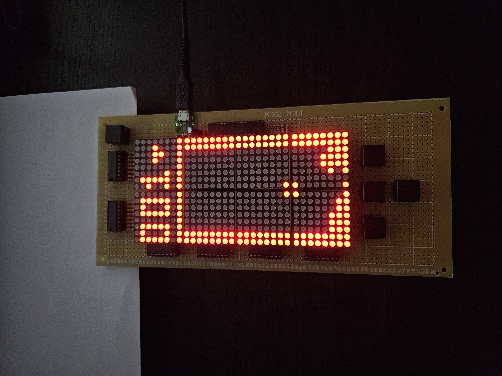
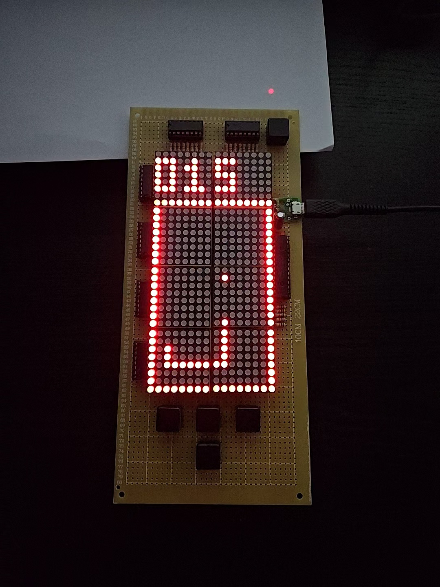

# gametoy_avr

`gametoy_avr` is a fun and quick project created using the hardware from the
[Tetris on ATmega328p](https://github.com/JZimnol/Tetris_ATmega328p) project.
It runs on the [avrtos](https://github.com/JZimnol/avrtos) - a very simple RTOS
created specifically for the AVR ATmega boards.

In the most basic version it contains two games: `tetris` and `snake`.

## Welcome screen

## Tetris

## Snake

